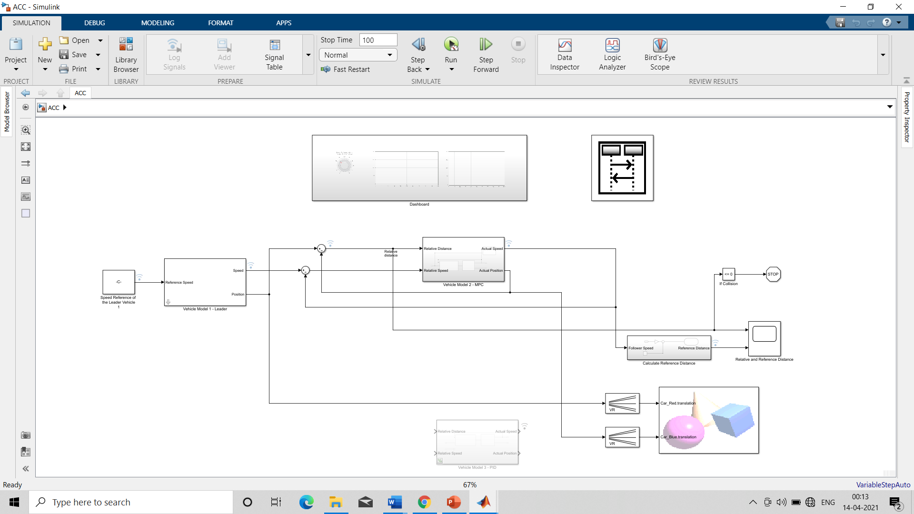

# Adaptive Cruise Control System using MATLAB and Simulink

## Overview

The Adaptive Cruise Control (ACC) System developed in MATLAB and Simulink utilizes Model Predictive Control (MPC) to enable longitudinal speed control for the follower vehicle over a range of speed profiles. The ACC system aims to maintain a safe distance from the leader vehicle while optimizing the gas pedal actuation sequence for a comfortable ride with minimal overshoot.

*Fig.3 Simulink Model of Adaptive Cruise Control System*

## Model Design

The following steps provide an overview of how the complete ACC model was designed from scratch:

1. **Developing Preliminary Vehicle Model:**

   - A transfer function is used to convert acceleration to speed, simulating the gas pedal's effect on the vehicle's acceleration.
   - An integrator block is added to model the integration of acceleration to obtain speed.
   - A first-order low-pass filter is used to modify, reshape, or reject unwanted frequencies in the acceleration signal.
   - A saturation block is introduced to mimic realistic acceleration and deceleration characteristics of actual vehicles.

2. **Using Linear MPC to Model ACC:**

   - The model obtains the relative distance between the leader and follower vehicle.
   - The MPC block takes inputs such as set velocity, time gap, longitudinal velocity, and relative distance, and provides longitudinal acceleration as output.

3. **Tuning MPC:**

   - This step focuses on optimizing the computation time and robustness of the MPC block.
   - Sample time and prediction horizon steps are adjusted to achieve efficient control.
   - A stop block is introduced to halt the simulation if the relative distance falls below 0, indicating a potential collision.

4. **VR Sink Block and Signal Expander Block:**

   - The VR sink block is fed a .WRL extension file representing the environment, where vehicles are designed using the VR-Realm editor.
   - The signal expander matches the signal dimensions with the VR sink block, enabling the longitudinal velocity vector to control the axis of movement.

## Vehicle Behavior Planner using Stateflow

The ACC system includes different driving modes to ensure safe and smooth driving based on the relative distance between the leader and follower vehicle.

*Fig.5 Stateflow sequence viewer*

- **Free Mode:** This mode is activated when the distance between vehicles is greater than a threshold value. The follower vehicle drives freely with a linear time-invariant vehicle model as the leader vehicle. A switch function block toggles between free mode and ACC mode.

- **ACC Mode:** This mode activates when the relative vehicle distance falls below a specified threshold (e.g., 10 m). The follower vehicle maintains a safer distance from the leader vehicle with an optimum speed profile determined by the MPC control module.

- **Emergency Brake Mode:** When a collision is imminent, the vehicle applies emergency brakes to prevent accidents.

## Optimization with MPC

By solving the optimization problem, MPC minimizes the error between the reference velocity and the predicted velocity. The cost function J is minimized to achieve a comfortable ride with minimal overshoot. The predicted velocity with the minimum cost function represents the optimal gas pedal actuation sequence.

## Graphs and Scenarios

The following graphs illustrate the behavior of the ACC system in different scenarios:

1. **Relative Distance and Velocity Graph:**

*Fig.4 Relative distance and velocity graph*

This graph provides an understanding of the inter-vehicular distance and velocity over time.

2. **Free Driving Mode Scenario:**

*Fig.6 Free driving mode Scenario*

This scenario depicts the free driving mode when the relative vehicle distance is 20 m. In this mode, the follower vehicle's velocity gradually increases as it approaches the rear of the leader vehicle.

3. **Adaptive Cruise Mode Scenario:**

*Fig.7 Adaptive cruise mode Scenario*

This scenario shows the Adaptive Cruise Control mode, which activates when the relative vehicle distance falls below 10 m. The follower vehicle maintains a safe distance from the leader vehicle with an optimum speed profile determined by the MPC control module.

## Getting Started

To run the ACC system simulation in MATLAB and Simulink, follow these steps:

1. Clone or download this repository.

2. Open the main Simulink model file.

3. Set the required parameters and initial conditions.

4. Run the simulation to observe the ACC system's behavior.

Feel free to explore and modify the model as per your requirements.

## License

This ACC system is provided under the MIT License. Please see the [LICENSE](path/to/LICENSE) file for more details.

For any inquiries or feedback, please contact [hsbhat_b18@me.vjti.ac.in].
